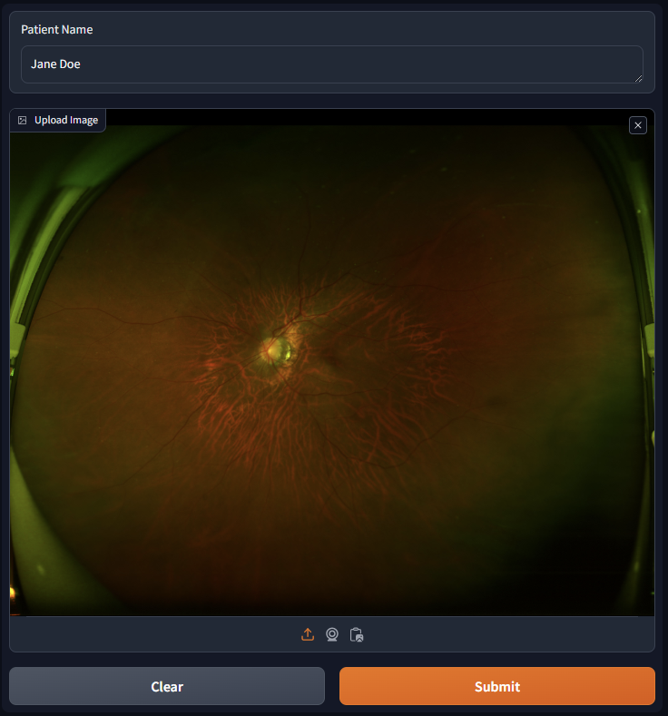
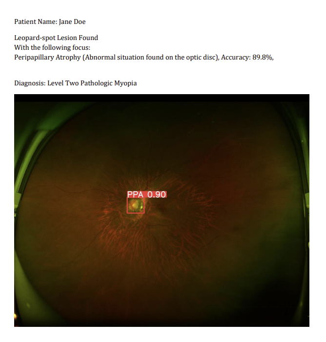

# Pathological High Myopia Detection
This project is based on ResNet101 and YOLOv8 to detect the focus that cause high myopia

## Table of Content
[Final Product](#final-product)  
[Dataset Preparation](#dataset-preparation)  
[Quick Start](#quick-start)

## Final Product
In the webui, the user can upload an ultra high definition fundus image and type in the name  
  
  
  
The program will run classification model and trained YOLOv8 model to identify the focus (Labeled image and word result)  
  
  
  
After identification, the program will summarize all of the data into a pdf file  
  
  

## Dataset Preparation
  
## Quick Start
### Install Dependencies
```shell
pip install -r requirements.txt
```
### Train the classification model (Default is ResNet18)
```shell
python classification.py 
```
or use jupyter notebook to run  

### Train YOLOv8 detection model 
```shell
python yolo.py
```
or use jupyter notebook to run

### Run the webui
```shell
Usage: python webui.py [options]

A common command: python webui.py

-l --language       Language of the UI site
```