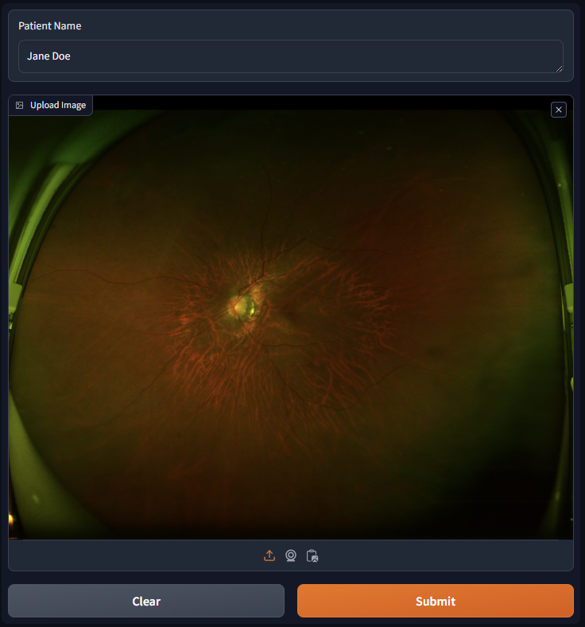
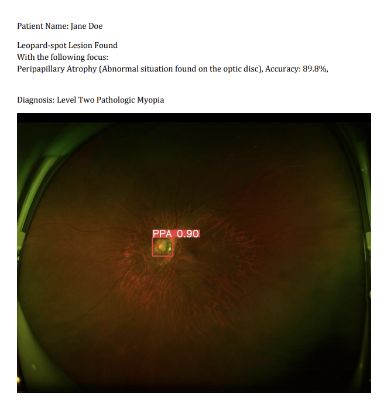
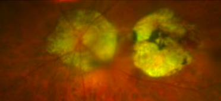
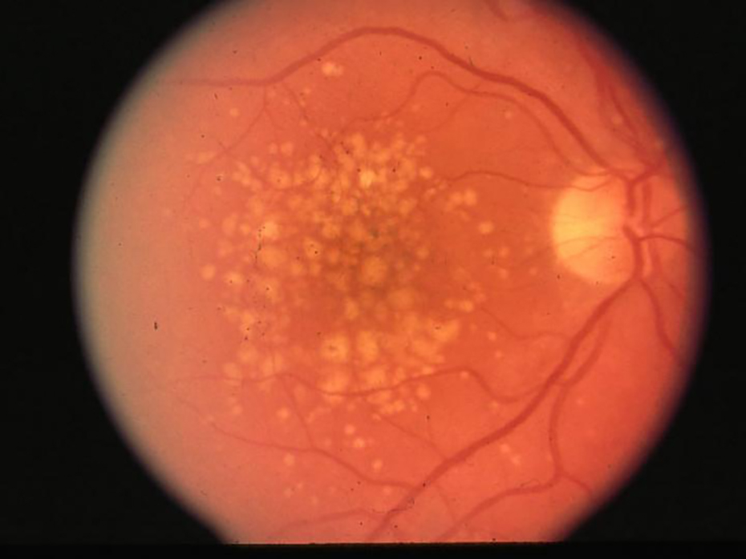
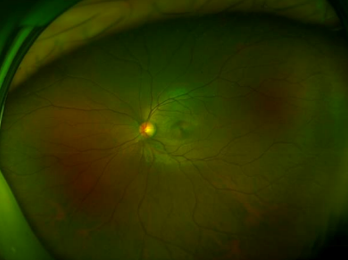

# 病理性高度近视检测
基于ResNet和YOLOv8的病理性高度近视检测

## <div align="center"><b><a href="README.md">English</a> | <a href="README_ZH.md">简体中文</a></b></div>

## 目录
- [成果](#成果)  
- [数据集准备](#数据集准备)  
- [快速开始](#快速开始)  
- [参考](#参考)
- [声明](#声明)

## 成果
在最后的webui中，使用者可以输入患者名称并上传患者的超高清眼底图彩照  
  
  
  
模型会首先进行分类（是否有豹纹状改变）然后会用YOLOv8来识别病灶  
  
  
  
识别完成后，会总结所有的结果并同时输出到webui和pdf文件中  
  
  
#### [输出文件](output/Jane_Doe_report.pdf)

## 数据集准备
#### [数据集](dataset)分为两部分:  
- [分类](#分类)  
- [检测](#检测)  

### 分类
分类算法会对患者的眼底图进行分类：有无豹纹状改变  

在[dataset/classification](dataset/classification)文件夹下有两个子文件夹:  
```
├─dataset
   ├─classification
      ├─train   <- 训练集
      │  ├─no       <- 没有豹纹状改变
      │  └─yes      <- 有豹纹状改变
      └─val     <- 测试集
          ├─no
          └─yes
```

### 检测
#### 病灶类型:  
|英文名|中文名|标签|
|---|---|---|
|peripapillary atrophy|视盘萎缩斑|PPA|
|macular degeneration|黄斑萎缩|MD|
|vitreous opacities|玻璃体浑浊|weiss|
|drusen|玻璃膜疣|DR|
|optic disc|正常视盘|OD|
|fuchs dystrophy|福斯氏角膜内皮营养不良|Fuchs|  
  
#### Peripapillary Atrophy 视盘萎缩斑 (PPA)
高度近视患者的症状表现，高度近视眼因眼轴的过度伸长，可引起眼底的退行性改变。 黄斑部可发生形成不规则的、单独或融合的白色萎缩斑，有时可见出血。  
  

#### Macular Degeneration 黄斑萎缩 (MD)  
AMD (MD) 又叫年龄相关性黄斑变性，能够影响视网膜中心区域黄斑。AMD在绝大多数情况下见于双眼，病程为进行性，最终可导致中央视觉永久丧失，也是工业化国家中50岁以上人群视力低下的首要原因。  


#### Vitreous Opacities 玻璃体浑浊 (weiss)
玻璃体浑浊又称飞蚊症。 先天残留于玻璃体内的胚胎细胞或组织、视网膜或葡萄膜的出血侵入玻璃体内，高血压、糖尿病、葡萄膜炎的出血或渗出物侵入玻璃体内，老年人高度近视眼的玻璃体变性，均可导致玻璃体液化而浑浊。 其他如眼外伤、眼内异物存久留、寄生虫或肿瘤等也可发生玻璃体浑浊。  
  

#### Drusen 玻璃膜疣 (DR)
玻璃膜疣是胶样或透明的小体，是一种发生在脉络膜视网膜的一种变性疾病，是色素上皮细胞异常代谢产物在视网膜上的异常沉积所致。  
  

#### Optic Disc 正常视盘 (OD)
正常视盘略呈椭圆形、淡红色、边界清楚，中央呈漏斗形凹陷，色泽稍淡，称为生理凹陷。  
  

#### Fuchs Dystrophy 福斯氏角膜内皮营养不良 (Fuchs)
在福斯氏角膜内皮营养不良患者中，液体积累在眼睛前方的透明层（角膜）中，造成角膜肿胀和增厚。 这可能导致眩光、视力模糊或浑浊以及眼睛不适。 福斯氏角膜内皮营养不良通常侵袭双眼，可能在多年中导致视力逐渐下降。  
  

## 快速开始
### 下载依赖
```shell
pip install -r requirements.txt
```
### 训练分类算法（网络结构默认ResNet18）
```shell
python classification.py 
```
或者使用jupyter notebook  

### 训练YOLOv8
```shell
python yolo.py
```
或者使用jupyter notebook  

### 运行webui
```shell
Usage: python webui.py [options]

A common command: python webui.py

-l --language       Language of the UI site
```

## 参考
* [【图像分类】实战——使用ResNet实现猫狗分类（pytorch）](https://juejin.cn/post/7012922120392933383)
* [Ultralytics YOLOv8](https://docs.ultralytics.com/modes/train/)
* [搭建一个简单的神经网络LeNet（基于PyTorch）](https://blog.csdn.net/ft_sunshine/article/details/91388812)
* [Gradio Documentation](https://www.gradio.app/docs)

## 声明
#### 本人对于眼科的专业水平并不高，如有问题，欢迎pull request或者在issue里面提出（万分感谢）  