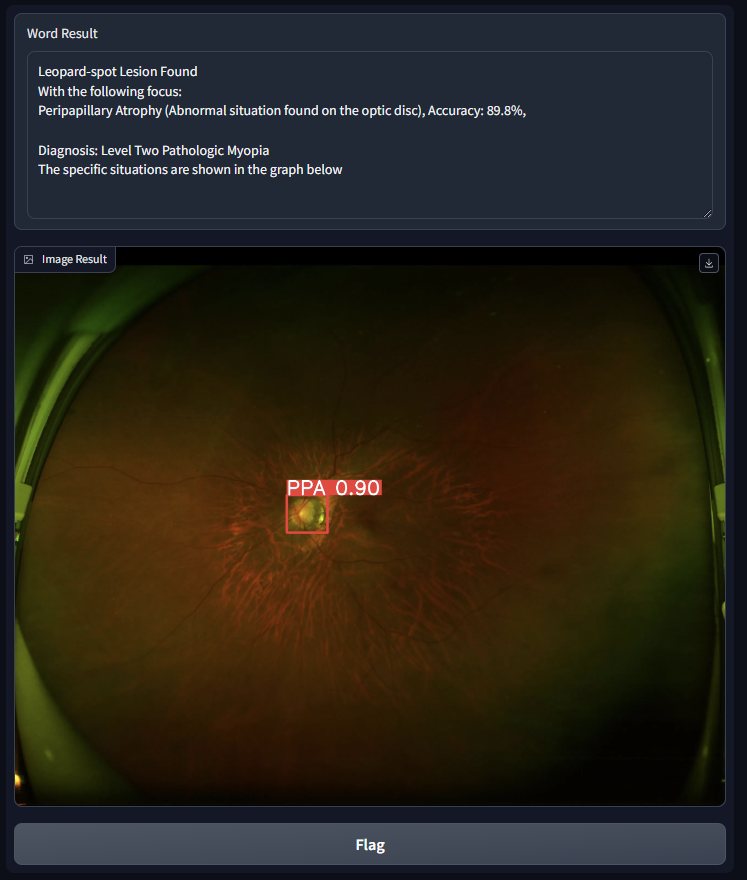
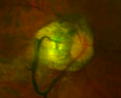

# 病理性高度近视检测
This project is based on ResNet101 and YOLOv8 to detect the focus that cause high myopia

## <div align="center"><b><a href="README.md">English</a> | <a href="README_ZH.md">简体中文</a></b></div>

## 目录
[Final Product](#final-product)  
[Dataset Preparation](#dataset-preparation)  
[Quick Start](#quick-start)  
[Reference](#reference)

## 成果
In the webui, the user can upload an ultra high definition fundus image and type in the name  
  
  
  
The program will run classification model and trained YOLOv8 model to identify the focus (Labeled image and word result)  
  
  
  
After identification, the program will summarize all of the data into a pdf file  
  
  
[Output File](output/Jane_Doe_report.pdf)

## 数据集准备
The [dataset](dataset) can be divided into two parts:  
[Classification](#classification)  
[Detection](#detection)  

### 分类
The Classification is mainly classifying the pictures with leopard-spot lesion or not.  

There are two directory under classification:  
```
├─dataset
   ├─classification
      ├─train   <- Training
      │  ├─no       <- Without leopard-spot lesion
      │  └─yes      <- With leopard-spot lesion
      └─val     <- Validation
          ├─no
          └─yes
```

### 检测
病灶类型:  
|Name|Label|
|---|---|
|peripapillary atrophy|PPA|
|macular degeneration|MD|
|vitreous opacities|weiss|
|drusen|DR|
|optic disc|OD|
|fuchs dystrophy|Fuch|  
  
#### Peripapillary Atrophy (PPA)
Peripapillary atrophy describes atrophy or thinning in the layers of the retina and retinal pigment epithelium around the optic nerve in the back of the eye  
  

#### Macular Degeneration (MD)  
Age-related macular degeneration is the most common cause of severe loss of eyesight among people 50 and older. Only the center of vision is affected with this disease. It is important to realize that people rarely go blind from it.  


#### Vitreous Opacities (weiss)
Vitreous opacities are floating objects inside the vitreous body. They can be of different sizes, shapes and densities. New objects are treated conservatively, and laser treatment is not usually indicated until the floaters stabilize in size and density.  
  

#### Drusen (DR)
Drusen bodies are extracellular deposits of lipids, proteins, and cellular debris which are found within the layers of the retina and appear as small, yellow deposits on dilated eye exams.  
  

#### Optic Disc (OD)
The optic disc is the round spot on the retina formed by the passage of the axons of the retinal ganglion cells, which transfer signals from the photoreceptors of the eye to the optic nerve, allowing us to see.  
  

#### Fuchs Dystrophy (Fuchs)
Fuchs (pronounced "fooks") dystrophy is an eye disease in which cells lining the inner surface of the cornea slowly start to die off. The disease most often affects both eyes.  

## 快速开始
### 下载依赖
```shell
pip install -r requirements.txt
```
### 训练分类算法（网络结构默认ResNet18）
```shell
python classification.py 
```
或者使用jupyter notebook  

### 训练YOLOv8
```shell
python yolo.py
```
或者使用jupyter notebook  

### 运行webui
```shell
Usage: python webui.py [options]

A common command: python webui.py

-l --language       Language of the UI site
```

## 参考
* [【图像分类】实战——使用ResNet实现猫狗分类（pytorch）](https://juejin.cn/post/7012922120392933383)
* [Ultralytics YOLOv8](https://docs.ultralytics.com/modes/train/)
* [搭建一个简单的神经网络LeNet（基于PyTorch）](https://blog.csdn.net/ft_sunshine/article/details/91388812)
* [Gradio Documentation](https://www.gradio.app/docs)